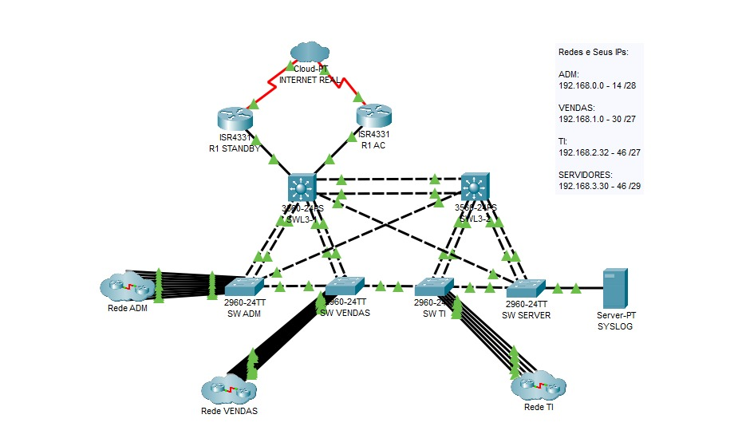

# 🏢 Enterprise Network Project

> Simulação de uma infraestrutura de rede empresarial desenvolvida no Cisco Packet Tracer, aplicando conceitos de segmentação, alta disponibilidade, segurança e monitoramento.

---

# 📖 Sobre o Projeto

Este projeto foi desenvolvido com o objetivo de simular uma infraestrutura de rede empresarial baseada em boas práticas de administração de redes. A solução foi projetada para atender diferentes departamentos da empresa, garantindo organização, disponibilidade, segurança e facilidade de gerenciamento.

---

# 📌 Objetivo

Projetar uma infraestrutura de rede empresarial capaz de oferecer comunicação eficiente entre os setores da empresa, alta disponibilidade dos serviços, segurança no tráfego de dados e facilidade de administração. O projeto busca simular um ambiente corporativo aplicando boas práticas de infraestrutura de redes.

---

# 🚨 Problema

Uma infraestrutura de rede sem planejamento pode apresentar diversos problemas, como:

- Falta de segmentação entre departamentos;
- Baixa disponibilidade em caso de falhas de links ou dispositivos;
- Loops na camada 2 comprometendo o tráfego;
- Dificuldade no monitoramento dos dispositivos;
- Ausência de redundância de gateway;
- Falta de controle de acesso entre diferentes setores.

---

# 💡 Solução

Para solucionar esses desafios, foram implementadas as seguintes tecnologias:

- **VLANs:** Segmentação lógica da rede por departamentos;
- **VLSM:** Otimização do endereçamento IP;
- **DHCP:** Distribuição automática de endereços IP;
- **Inter-VLAN Routing:** Comunicação controlada entre redes via switches Layer 3;
- **HSRP:** Redundância do gateway padrão;
- **EtherChannel (LACP):** Redundância e agregação de links de alta velocidade;
- **STP (PVST+):** Prevenção de loops na camada 2;
- **ACLs:** Controle de acesso e segurança entre redes;
- **Syslog:** Centralização do registro de logs da infraestrutura;
- **NTP:** Sincronização de horário entre os dispositivos;
- **LLDP:** Descoberta automática e suporte à documentação da topologia.

---

# 🛠 Tecnologias Utilizadas

- Cisco Packet Tracer
- VLAN / VLSM / DHCP
- Inter-VLAN Routing
- HSRP / EtherChannel (LACP) / STP (PVST+)
- ACL (Access Control Lists)
- Syslog / NTP / LLDP

---

# 🌐 Topologia



---

# ⚙️ Funcionalidades

- Segmentação eficiente da rede utilizando VLANs;
- Comunicação roteada e segura entre VLANs;
- Distribuição automática de endereços IP via DHCP com VLSM;
- Redundância de gateway ativo/espera utilizando HSRP;
- Agregação de enlaces com EtherChannel para aumento de largura de banda e redundância;
- Prevenção de loops de Camada 2 utilizando STP;
- Restrição de tráfego não autorizado através de ACLs;
- Centralização de logs de auditoria utilizando Syslog;
- Sincronização de horário entre os equipamentos via NTP;
- Mapeamento dinâmico da topologia através do protocolo LLDP.

---

# 📈 Resultados

Com a implementação da solução foi possível obter:

- Segmentação eficiente e isolamento de tráfego entre setores;
- Alta disponibilidade do gateway principal com fallback automático via HSRP;
- Tolerância a falhas em links físicos com EtherChannel;
- Estabilidade de rede com eliminação de loops via STP;
- Controle detalhado de acessos entre ambientes corporativos;
- Visibilidade centralizada da saúde e eventos da rede via Syslog;
- Sincronização temporal precisa para análise de eventos;
- Infraestrutura organizada, documentada e preparada para expansões.

---

# 📚 Aprendizados

Durante o desenvolvimento deste projeto foram aprofundados conhecimentos práticos em:

- Planejamento e arquitetura de redes corporativas;
- Endereçamento IP avançado com VLSM;
- Configuração de roteamento e comutação Cisco;
- Implementação de protocolos de alta disponibilidade e redundância (HSRP e EtherChannel);
- Hardening básico e segurança de camada 2/3 (STP e ACLs);
- Gerenciamento e monitoramento de ativos de rede.

---

# 📂 Estrutura do Repositório

```text
enterprise-network-cisco/
│
├── README.md
├── docs/
│   └── Rede Empresarial.pdf
├── images/
│   ├── topologia.png
│   ├── vlan.png
│   ├── hsrp.png
│   ├── etherchannel.png
│   ├── stp.png
│   └── syslog.png
└── packet-tracer/
    └── Empresa.pkt
